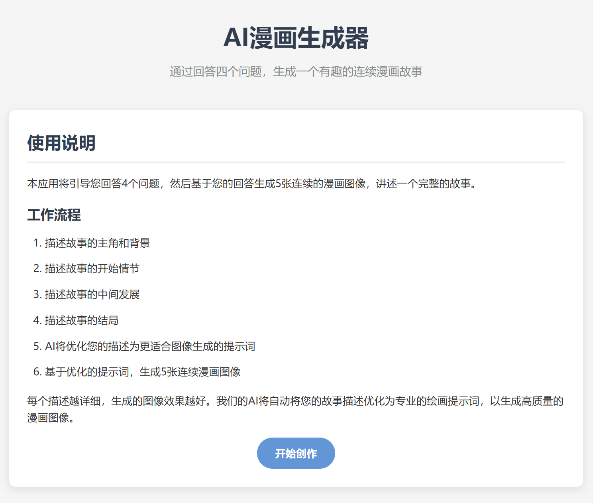
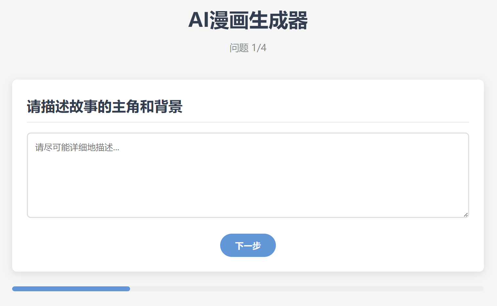
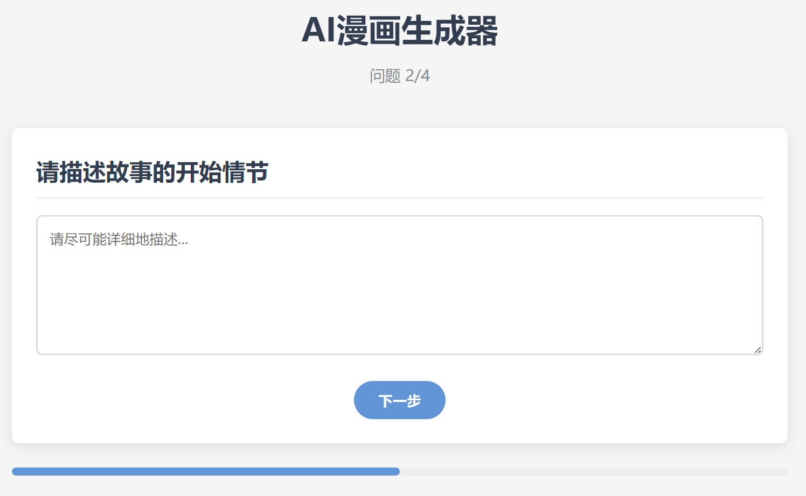
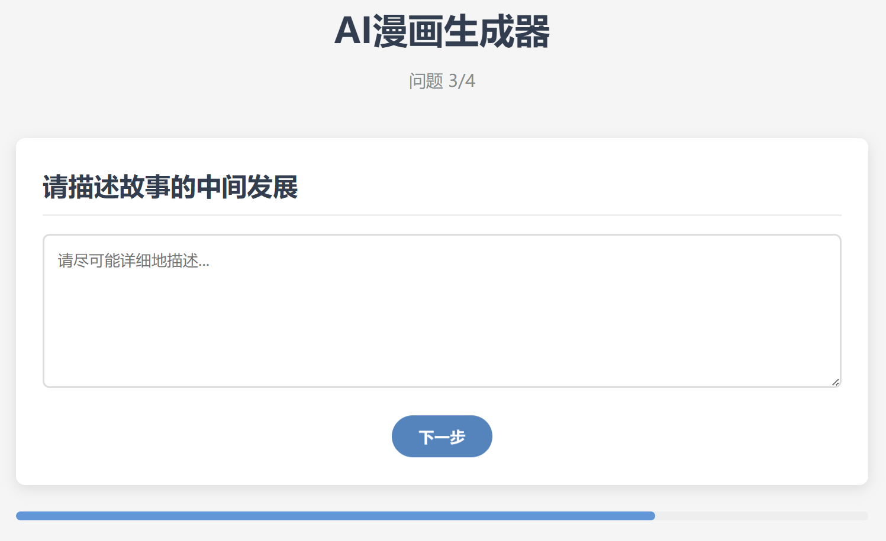
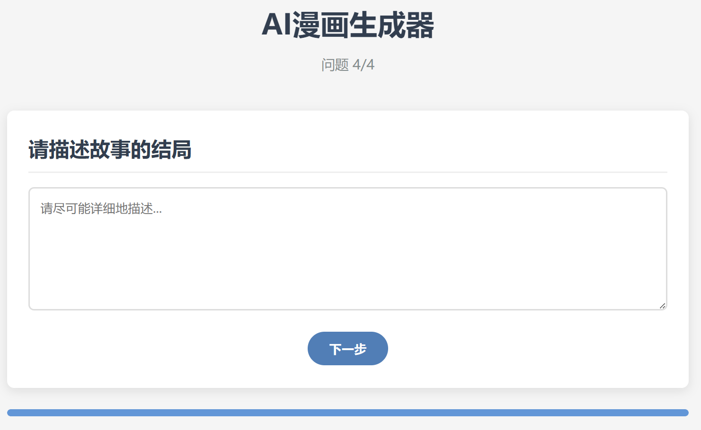

# AI漫画生成器

这是一个基于Python Flask的网页应用，通过询问用户4个问题，利用AI优化提示词，生成连续的5张漫画图像，讲述一个完整的故事。

## 功能特点

- 用户友好的界面
- 引导式问答生成故事内容
- AI自动优化用户输入为专业绘画提示词
- 使用Kolors模型生成高质量漫画图像
- 展示连续的故事情节
- 五张图像完整讲述一个故事

## 技术亮点

- 集成文本模型（QwQ/Qwen2.5-7B）进行提示词优化
- 图像生成模型（Kolors）生成高质量漫画
- 流畅的用户体验流程
- 响应式设计，适配各种设备

## 安装说明

1. 克隆仓库
```
git clone https://github.com/Ljx-007/comic-generator.git
```

2. 安装依赖
```
pip install -r requirements.txt
```

3. 填写配置文件config.yml
```
APIKey: your apikey
```
填入您硅基流动的API密钥。

## 运行应用

```
python app.py
```
应用将在`http://127.0.0.1:5000/`启动。

## 技术栈

- Python 3.8+
- Flask 2.0.1
- 硅基流动Kolors模型API (图像生成)
- 硅基流动Qwen2.5-7B模型API (文本优化)

## 项目结构

```
app.py                  # 主应用文件
templates/              # HTML模板
  index.html            # 首页
  questions.html        # 问题页面
  result.html           # 结果页面
static/                 # 静态资源
  css/                  # CSS样式
    style.css           # 主样式表
  js/                   # JavaScript脚本
    main.js             # 主脚本文件
config.yml.example      # 配置文件示例
requirements.txt        # 项目依赖
```

## 使用流程

1. 访问首页，点击"开始创作"按钮
2. 回答关于故事的4个问题
   - 描述故事的主角和背景
   - 描述故事的开始情节
   - 描述故事的中间发展
   - 描述故事的结局
3. AI会自动将您的回答优化为5个专业的绘画提示词
4. 系统根据优化后的提示词生成5张连续图像
5. 欣赏您的故事漫画并查看AI如何优化您的描述

## 设计原则

本项目遵循以下软件设计原则:
- DRY原则：通过模板继承和组件重用减少重复
- SOLID原则：模块化设计，每个功能独立封装
- KISS原则：保持简单直观的界面和代码
- 高内聚低耦合：相关功能组织在一起，模块间依赖最小化

## 注意事项

- 您需要有效的API令牌才能使用此应用
- 提供详细的描述可以获得更好的图像生成效果
- 可以自行更换生图模型和提示词优化模型，更好的模型将会取得更好的效果

## 示例






